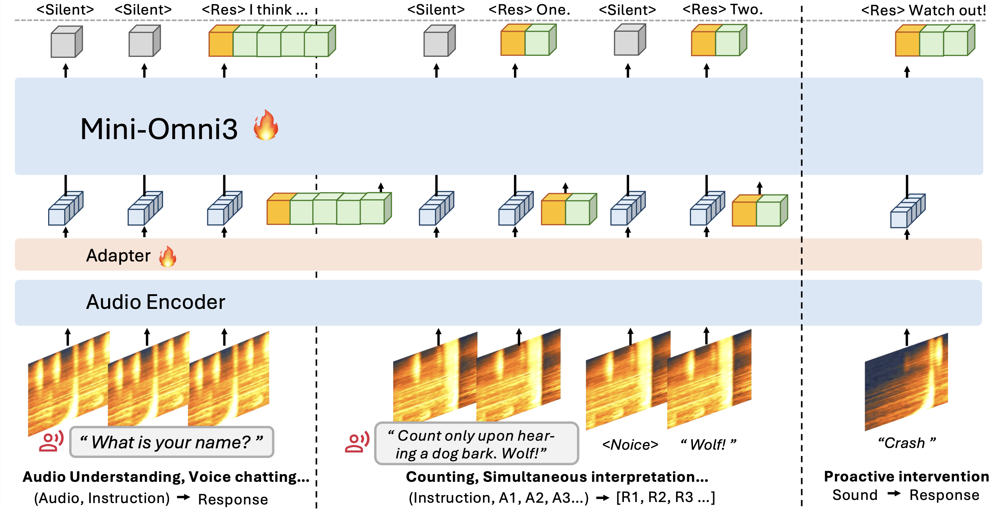
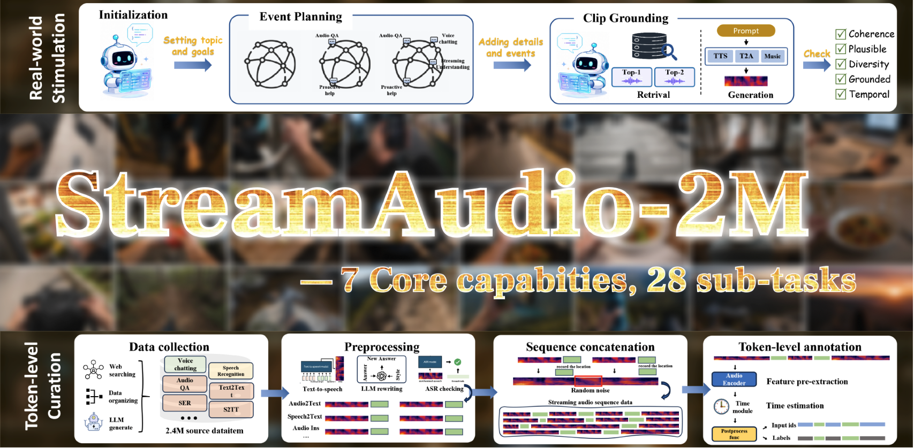

# Audio Interaction Model

<p align="center">
  
</p>

Today's Large Audio Language Models (LALMs) are stuck in an offline paradigm: you hand them a complete audio clip, wait, and get a reply. Streaming audio models exist, but each one only handles a single, isolated task. There has never been a general streaming audio language model. We formalize that missing capability as a new concept **the Audio Interaction Model** and build the first one.
AudioInteraction is a unified Audio Interaction Model that:

✅ Runs conventional offline audio tasks (ASR, S2TT, AQA...)

✅ Runs streaming audio tasks in real time (Voice chatting...)

✅ Achieves general streaming audio instruction following on a live stream

✅ Does all of the above inside a single, all-in-one model, and be always-on and proactive


<p align="center">
  <a href="https://arxiv.org/abs/2605.XXXXX">Technical Report 📖</a> /
  <a href="https://huggingface.co/datasets/AudioInteraction/SoundFlow-260K">StreamAudio-2M 🤗</a> /
  <a href="https://huggingface.co/AudioInteraction/AudioInteraction">AudioInteraction Model 🤗</a> /
  <a href="https://github.com/AudioInteraction/Streaming-Audio-Bench">Streaming-Audio-Bench 🏆</a>
</p>

<p align="center">
  <a href="https://github.com/AudioInteraction/AudioInteraction/raw/main/assets/wechat.jpg"></a>&nbsp;<a href="https://AudioInteraction.github.io/"></a>&nbsp;<a href="https://x.com/"></a>
</p>


<p align="center">
  <a href="https://www.youtube.com/watch?v=r1S4xiUBg9s">
    
  </a>
</p>
<p align="center"><em>▶ Click to watch AudioInteraction listen, decide, and speak — live (YouTube)</em></p>


## 🔥 News

- [Coming]: We will release the full dataset and data curation pipeline.
- [Coming]: The full training configs and pipeline.


- **May 20, 2026**: 🔥 We release **StreamAudio-2M**.
- **May 20, 2026**: 🔥 We release the **AudioInteraction Inference and Training Codebase**.
- **May 19, 2026**: 🔥 **AudioInteraction** model weights are now available on Hugging Face.
- **May 19, 2026**: 🔥 We release the **AudioInteraction Technical Report**.


## Contents

* **[Quick Start](#quick-start)**
* **[Demos](#demos)** 
* **[SoundFlow: Train your own Audio Interaction Model](#how-it-works)**
* **[StreamAudio-2M dataset](#datasets)**
* **[Evaluation results](#evaluation)**
* **[License, Citation & Stars](#citation)**


## <a id="quick-start"></a>⚡ Quick Start

AudioInteraction is an always-on model: it keeps listening to incoming audio frames and **decides for itself when to speak**. By default it stays in a `⟨Silent⟩` state and only emits output when the task or the acoustic context warrants it — so you can open a single session, stream audio into it continuously, and watch every capability take turns on its own.

**Installation**
```bash
git clone https://github.com/AudioInteraction/AudioInteraction.git
cd AudioInteraction

conda create -n AudioInteraction python=3.12 -y
conda activate AudioInteraction
# please check if you are using torch-cuda
pip install -r requirements.txt
# install ffmpeg
conda install -c conda-forge ffmpeg
```

**Download Weights**
```bash
# download model weights from huggingface
export PYTHONPATH=./
python download.py
```

**WebUI real-time demo**
```bash
# download model weights from huggingface
export PYTHONPATH=./
python web/server.py

# then goto localhost:5001
```

**Inference**
```bash
# infer with default audio. make sure add ./ to the project base dir.
# infer_online stimulate continous audio input.
export PYTHONPATH=./
python infer_online.py

# Use your own audio for offline testing:
python infer_offline.py

# Or try the three bundled sample sequences (set input_path in infer_offline.py to one of them):
#   sample/01_count_bark/sequence.json, sample/02_translate/sequence.json, sample/03_cough_music/sequence.json
```


## <a id="demos"></a>🎬 Demos

Most audio models do one job and wait to be asked. AudioInteraction's defining trait is that **all of its abilities live in the same continuous stream**, and the model itself decides which one is needed at each moment. The demo below is **one unbroken session, one model, no mode switches, no prompts** — transcription, understanding, conversation, and proactive intervention simply happen as the soundscape changes.

<div align="center">
  <video src="assets/demo/all_in_one_session.mp4" controls width="320"></video>
</div>


#### Capability 1 — Online audio understanding

<table>
  <tr>
    <th valign="top">Input (streaming)</th>
    <th valign="top">gpt-audio</th>
    <th valign="top">doubao-voicechat</th>
    <th valign="top">gemini-omni</th>
    <th valign="top">AudioInteraction (Ours)</th>
  </tr>
  <tr>
    <td valign="top">Continuous ambient audio: footsteps, a door opening, distant traffic.</td>
    <td valign="top">❌ Record-then-infer: waits for the clip to end, then returns one summary — no incremental narration.</td>
    <td valign="top">⚠️ Speech-centric: lumps non-speech into "background noise" and misses individual events.</td>
    <td valign="top">⚠️ Buffers a fixed window first, so narration lags several seconds behind the sound.</td>
    <td valign="top">✅ Detects each event incrementally and narrates the scene in real time, without waiting for the clip to end.</td>
  </tr>
</table>

<details>
<summary><strong>Capabilities 2 – 4 (transcription &amp; translation · full-spectrum chat · proactive intervention)</strong></summary>

<br>

#### Capability 2 — Real-time transcription &amp; translation

<table>
  <tr>
    <th valign="top">Input (streaming)</th>
    <th valign="top">gpt-audio</th>
    <th valign="top">doubao-voicechat</th>
    <th valign="top">gemini-omni</th>
    <th valign="top">AudioInteraction (Ours)</th>
  </tr>
  <tr>
    <td valign="top">A speaker talking continuously while the model listens.</td>
    <td valign="top">⚠️ Clean transcript, but only after the utterance finishes — no mid-sentence partials.</td>
    <td valign="top">⚠️ Streams ASR well, but translation is turn-based and only fires at sentence boundaries.</td>
    <td valign="top">⚠️ Emits chunks but re-decodes aggressively, causing flicker and unstable partials.</td>
    <td valign="top">✅ Emits partial transcripts and translations chunk by chunk with low latency, correcting incrementally as context arrives.</td>
  </tr>
</table>

#### Capability 3 — Voice chat beyond speech

<table>
  <tr>
    <th valign="top">Input (streaming)</th>
    <th valign="top">gpt-audio</th>
    <th valign="top">doubao-voicechat</th>
    <th valign="top">gemini-omni</th>
    <th valign="top">AudioInteraction (Ours)</th>
  </tr>
  <tr>
    <td valign="top">A user asks about a song playing in the background while talking.</td>
    <td valign="top">⚠️ Hears the speech but ignores the music — answers as if no song were playing.</td>
    <td valign="top">❌ Treats the music as noise to suppress; can't reason about it.</td>
    <td valign="top">⚠️ Can ID the song in isolation, but can't fuse it with the ongoing conversation.</td>
    <td valign="top">✅ Jointly perceives speech, music, and general audio, and responds in a context-aware, full-spectrum conversation.</td>
  </tr>
</table>

#### Capability 4 — Proactive intervention

<table>
  <tr>
    <th valign="top">Input (streaming)</th>
    <th valign="top">gpt-audio</th>
    <th valign="top">doubao-voicechat</th>
    <th valign="top">gemini-omni</th>
    <th valign="top">AudioInteraction (Ours)</th>
  </tr>
  <tr>
    <td valign="top">A smoke alarm starts beeping while the user is silent.</td>
    <td valign="top">❌ Stays silent — only responds when prompted; no self-initiated speech.</td>
    <td valign="top">❌ Waits for a wake word / user turn; never volunteers a warning.</td>
    <td valign="top">❌ No notion of <em>when</em> to speak; requires an explicit query.</td>
    <td valign="top">✅ Holds <code>⟨Silent⟩</code> until the acoustic cue appears, then switches to <code>⟨Speak⟩</code> and warns the user — no prompt required.</td>
  </tr>
</table>

</details>


## <a id="how-it-works"></a>⚙️ SoundFlow: Train your own Audio Interaction Model
Offline audio models answer a finished clip, but real audio needs a model that listens continuously and decides, moment to moment, whether to speak. SoundFlow trains a single model that at every chunk chooses between `⟨Speak⟩` and `⟨Silent⟩`, so recognition, translation, and dialogue become instructions inside one always-on perceive–decide–respond loop — a Large Audio Interaction Model (LAIM) — instead of separate per-task models. The framework covers the whole pipeline: stitching short clips into long interactions for data, chunk-level decision training with history review and comprehension-aware silence, and asynchronous FIFO inference that cuts first-frame latency by 4.5×.

<p align="center">
  
</p>

&nbsp;

## <a id="finetuning"></a>🔧 Finetuning ** data samples are in /src/audiointeraction/dataset/examples

You can fine-tune AudioInteraction on your own streaming data, and you can also use this repository to train standard offline audio language models. There are two steps: build the training data, then train.

### 1. Prepare training data

Edit the path constants at the top of each script first:

| File | Constants to fill in |
|---|---|
| `src/mini_omni3/dataset/get_feat.py` | `QWEN_OMNI_CKPT`, `AUDIO_TOWER_CKPT` |
| `src/mini_omni3/dataset/get_dataset_online.py` | `QWEN_OMNI_CKPT` |
| `src/mini_omni3/dataset/get_dataset_offline.py` | `QWEN_OMNI_CKPT`, `AUDIO_TOWER_CKPT` |

#### Input JSONL format

**Online** (streaming, multi-turn audio). One JSON object per line:

```json
{"conversation": [
    {"audio_path": "/path/to/turn1.wav", "assistant": "reply 1", "emotion": "normal"},
    {"audio_path": "/path/to/turn2.wav", "assistant": "reply 2", "emotion": "happy"}
]}
```

- `audio_path` and `assistant` are required on every turn.
- `emotion` is optional and defaults to `"normal"`. Allowed values: `happy`, `sad`, `angry`, `surprise`, `normal`, `urgent`.
- To make the model stay silent on a turn, set `assistant` to `"<no need to response>"`.

A single-turn shorthand is also accepted:

```json
{"merge_path": "/path/to/audio.wav", "assistant": "reply", "emotion": "normal"}
```

**Offline** (single-turn). One JSON object per line, either the flat form:

```json
{"user": "user text", "assistant": "reply", "audio_path": "/path/to/audio.wav"}
```

or the online-style multi-turn shape, in which case only the **first** turn is used:

```json
{"conversation": [{"user": "...", "assistant": "...", "audio_path": "..."}, ...]}
```

`assistant` is always required. The task variant is decided by which other fields are present:

| Has `audio_path`? | Has `user`? | Task |
|:---:|:---:|---|
| ✓ | ✓ | `A_T_T` — audio + user text → assistant |
| ✓ |   | `A_T` — audio → assistant |
|   | ✓ | `T_T` — user text → assistant |

#### Data process

```bash
# Online: <input.jsonl> <output.jsonl> <error.log> <feature_dir>
CUDA_VISIBLE_DEVICES=0 python src/mini_omni3/dataset/get_dataset_online.py \
    <input.jsonl> <output.jsonl> <error.log> <feature_dir>
# Example:
# CUDA_VISIBLE_DEVICES=0 python src/mini_omni3/dataset/get_dataset_online.py \
#     data/online_raw.jsonl data/online.jsonl logs/online.err features/online

# Offline: <input.jsonl> <output.jsonl> <error.log> <feature_dir>
CUDA_VISIBLE_DEVICES=0 python src/mini_omni3/dataset/get_dataset_offline.py \
    <input.jsonl> <output.jsonl> <error.log> <feature_dir>
# Example:
# CUDA_VISIBLE_DEVICES=0 python src/mini_omni3/dataset/get_dataset_offline.py \
#     data/offline_raw.jsonl data/offline.jsonl logs/offline.err features/offline
```

Both scripts are resumable: re-running picks up where the previous run stopped, skipping any `idx` that was already written. For a parallel multi-GPU template, see `src/mini_omni3/dataset/process_get_feature.sh`.

### 2. Train

```bash
# 1. Set the two data roots referenced by config.yaml
export DATA_ROOT=/path/to/your/jsonl/data
export CHECKPOINT_ROOT=/path/to/your/checkpoints
# Example:
# export DATA_ROOT=/data/mini_omni3/jsonl
# export CHECKPOINT_ROOT=/data/mini_omni3/ckpts

# 2. Edit hyperparameters / data sources in src/mini_omni3/finetune/config.yaml

# 3. Launch
python src/mini_omni3/finetune/full.py --config src/mini_omni3/finetune/config.yaml
# Example:
# python src/mini_omni3/finetune/full.py --config src/mini_omni3/finetune/config.yaml
```

## <a id="datasets"></a> 🎊 StreamAudio-2M: a large-scale stream audio instruction following corpus
<p align="center">
  
</p>

StreamAudio-2M is a ~2.6M-item streaming instruction-following corpus (7.4M rounds, 66.7K hours) covering seven capabilities — audio understanding, real-time ASR, speech translation, voice chatting, proactive response, and environment-aware agent — built by collecting clips from real-world datasets (AudioSet, CommonVoice, CoVoST2, MOSS, …), synthesizing text into speech with CosyVoice, then concatenating them into streaming sequences with environmental noise and token-level annotation.

### Sample structure

Each line is one streaming sequence made of multiple turns:

```json
{
  "id": "voice_chatting_000123",
  "stream_scene_type": "Home Smart",
  "num_turns": 2,
  "turns": [
    {
      "user": "Turn the living room lights down a bit.",
      "assistant": "Sure, dimming them to 40%.",
      "emotion": "normal",
      "scene_type": "Home Smart",
      "audio_path": "voice_chatting/000123/turn_0.wav"
    },
    {
      "user": "Thanks. What's the temperature in here?",
      "assistant": "It's 22.5 degrees in the living room.",
      "emotion": "normal",
      "scene_type": "Home Smart",
      "audio_path": "voice_chatting/000123/turn_1.wav"
    }
  ]
}
```

Set `assistant` to `"<no need to response>"` for a turn where the model should stay silent.

## <a id="evaluation"></a>📊 Experimental results of Audio-Interaction

### Table 1: Results on MMAU Benchmark

| Model | Size | Stream. | Multi-turn | Text Sound | Text Music | Text Speech | Text Avg. | Audio Sound | Audio Music | Audio Speech | Audio Avg. |
|---|---:|:---:|:---:|---:|---:|---:|---:|---:|---:|---:|---:|
| **_Large Audio Language Models_** |  |  |  |  |  |  |  |  |  |  |  |
| Audio Flamingo 2 | 3B | ✗ | ✗ | **71.47** | **70.96** | 44.74 | 62.40 | 1.50 | 1.49 | 0.35 | 1.16 |
| Qwen2-Audio-Instruct | 8.4B | ✗ | ✓ | 54.95 | 50.98 | 42.04 | 49.20 | 22.32 | 19.16 | 16.31 | 19.41 |
| Voxtral-Mini | 3B | ✗ | ✓ | 58.56 | 49.70 | 43.53 | 50.60 | 46.08 | 34.13 | 30.50 | 37.24 |
| Audio-Reasoner | 8.4B | ✗ | ✗ | 60.06 | 64.30 | **60.70** | 61.71 | 20.48 | 26.65 | 13.48 | 20.57 |
| **_Omni Language Models_** |  |  |  |  |  |  |  |  |  |  |  |
| Qwen2.5-Omni | 3B | ✗ | ✓ | 65.36 | 48.94 | 57.78 | 57.81 | 51.81 | 44.01 | 29.79 | 42.51 |
| Qwen2.5-Omni | 7B | ✗ | ✓ | <u>67.87</u> | <u>69.16</u> | <u>59.76</u> | **65.60** | 60.54 | <u>50.90</u> | <u>35.11</u> | <u>49.58</u> |
| Phi-4-multimodal | 7B | ✗ | ✓ | 60.97 | 52.87 | 52.83 | 55.56 | 44.65 | 27.84 | 21.99 | 31.75 |
| Baichuan-Omni-1.5 | 11B | ✗ | ✓ | 65.47 | 58.98 | 55.26 | 59.90 | 57.53 | 36.53 | 24.82 | 40.40 |
| **_Streaming Audio Language Models_** |  |  |  |  |  |  |  |  |  |  |  |
| **Audio-Interaction** | **3B** | **✓** | **✓** | 64.12 | 47.80 | 55.13 | 55.68 | **65.63** | **57.93** | **39.68** | **58.15** |

### Table 2: Performance on Spoken-Dialogue Benchmarks

| Model | Size | SpokenQA LLa. Q. | SpokenQA Web Q. | Voicebench Alpa. | Voicebench SD-QA |
|---|---:|---:|---:|---:|---:|
| **_Specialized Models_** |  |  |  |  |  |
| Moshi | 7B | 62.20 | 26.30 | 2.01 | 15.01 |
| Freeze-Omni | 7B | 72.00 | 44.73 | 4.14 | 50.16 |
| **_Omni & Audio Language Models_** |  |  |  |  |  |
| Baichuan-Omni-1.5 | 7B | **78.50** | <u>59.10</u> | **4.50** | 43.40 |
| Qwen2-Audio | 7B | 69.67 | 45.20 | 3.74 | 35.71 |
| Qwen2.5-Omni | 3B | 66.00 | 27.95 | 4.32 | 49.37 |
| Qwen2.5-Omni | 7B | 75.33 | **62.80** | <u>4.49</u> | **55.71** |
| Phi-4-multimodal | 7B | 60.2 | 26.6 | 3.81 | 39.78 |
| **_Streaming Audio Language Models_** |  |  |  |  |  |
| **Audio-Interaction** | **3B** | 67.31 | 54.34 | 4.28 | <u>52.14</u> |

### Table 3: ASR WER and S2TT BLEU on LibriSpeech and CoVoST2

| Model | Size | ASR Clean ↓ | ASR Other ↓ | S2TT en-zh ↑ | S2TT zh-en ↑ |
|---|---:|---:|---:|---:|---:|
| **_Specialized Models_** |  |  |  |  |  |
| Canary | 1B | **1.48** | **2.93** | - | - |
| Canary-Qwen | 2.5B | 1.49 | <u>3.10</u> | - | - |
| **_Omni & Audio Language Models_** |  |  |  |  |  |
| Baichuan-Omni-1.5 | 7B | 5.71 | 10.09 | - | - |
| Qwen2-Audio | 7B | 1.60 | 3.60 | 45.20 | 24.40 |
| Qwen2.5-Omni | 3B | 2.87 | 5.90 | 39.50 | 18.17 |
| Qwen2.5-Omni | 7B | <u>1.80</u> | 3.40 | 41.40 | <u>29.40</u> |
| Phi-4-multimodal | 5.6B | 1.69 | 3.82 | <u>46.30</u> | 22.39 |
| **_Streaming Audio Language Models_** |  |  |  |  |  |
| **Audio-Interaction** | **3B** | 3.17 | 6.04 | **55.22** | **35.21** |


## Acknowledgements

We sincerely thank the creators, maintainers, and contributors of the public datasets and resources used in this work. We also thank the broader large audio language model community for laying the groundwork that made streaming audio modeling possible.

In particular, this project builds on the following open-source repositories:

- [Qwen2.5-Omni](https://github.com/QwenLM/Qwen2.5-Omni) — the audio encoder and language model backbone behind AudioInteraction.
- [LitGPT](https://github.com/Lightning-AI/litgpt) — the training framework our finetuning code is built on.
- [CosyVoice](https://github.com/FunAudioLLM/CosyVoice) — the text-to-speech model used to synthesize speech during data construction.


## <a id="citation"></a>License, Citation & Stars

This project will be released under the **Apache-2.0 License**. You can do everything with AudioInteraction 🎉

**Citation**: You can cite AudioInteraction using the following BibTeX entry. Thank you for your kindness 🙂

```bibtex
@misc{audiointeraction,
      title={AudioInteraction: An Always-On Streaming Audio Language Model for the Real World},
      author={AudioInteraction Team},
      year={2026},
      eprint={2605.XXXXX},
      archivePrefix={arXiv},
      primaryClass={cs.SD},
      url={https://arxiv.org/abs/2605.XXXXX},
}
```

<a href="https://www.star-history.com/?repos=xzf-thu%2FAudioInteraction&type=date&legend=top-left">
 <picture>
   <source media="(prefers-color-scheme: dark)" srcset="https://api.star-history.com/chart?repos=xzf-thu/AudioInteraction&type=date&theme=dark&legend=top-left" />
   <source media="(prefers-color-scheme: light)" srcset="https://api.star-history.com/chart?repos=xzf-thu/AudioInteraction&type=date&legend=top-left" />
   
 </picture>
</a>